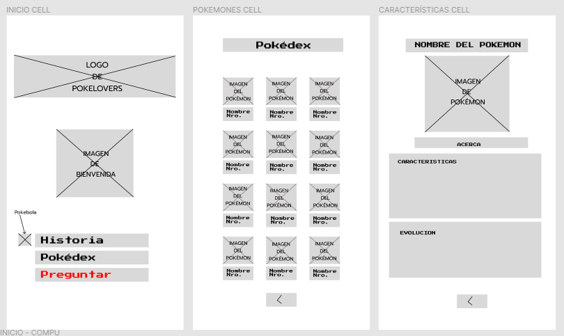

# PokéLovers

## Índice

* [1. Tema](#1-tema)
* [2. Introducción](#2-introducción)
* [3. Planteamiento del problema](#3-planteamiento-del-problema)
* [4. Objetivos](#4-objetivos)
* [5. Investigación UX](#5-investigación-ux)

***

## 1. Tema

Página web informativa sobre Pokémon dedicada a fans de las dos primeras generaciones con uso de una API.

## 2. Resumen del proyecto

Pokémon (ポケモン) es una franquicia de medios que originalmente comenzó como un videojuego RPG, pero debido a su popularidad ha logrado expandirse a otros medios de entretenimiento como series de televisión, películas, juegos de cartas, ropa, entre otros, convirtiéndose en una marca reconocida en el mercado mundial. 
La primera generación de Pokémon transcurre en la región de Kanto, por lo que el nombre de esta región suele verse asociado a estos videojuegos de la primera generación. El número de pokémon de estas versiones es de 151, desde Bulbasaur hasta Mew.
Por su parte, la segunda generación, aparece una nueva región conocida como Johto,​ donde se habían descubierto 100 pokémon nuevos (desde Chikorita hasta Celebi), llevando un total de 251 hasta en ese entonces. Johto también escondía misterios como el de las antiguas Ruinas Alpha, o el de la Torre Tin. ([Wikipedia](https://es.wikipedia.org/wiki/Pok%C3%A9mon), 2022)

Al respecto, este 11 de noviembre de 2022 Ash Ketchum finalmente se coronó como Campeón Mundial de Pokémon, 25 años después de iniciar su viaje. Por esta razón el equipo del presente proyecto decidió conmemorar este logro creando una aplicación dedicada a los fans de las primeras generaciones quienes han acompañado a Ash en esta aventura hasta convertirse en el campeón mundial de Pokémon. 

## 3. Planteamiento del problema

Pokémon GO es un videojuego de realidad aumentada basado en la localización para dispositivos iOS y Android.​ De esta manera, en 2022  se registraron más de 23 millones de descargas. Por otro lado, no solo existen fans de este videojuego sino también de las diferentes versiones de Nintendo, de la serie y de los artículos físicos vendidos como los álbumes. 
Adicionalmente, este año Ash Ketchum se coronó como campeón mundial de Pokémon. Por esta razón, las autoras del presente proyecto crearán una página web dedicada a los fans de Pokémon y especialmente los de las primeras generaciones para rememorarlas. 

## 4. Objetivos

### Objetivo General

Crear una página web informativa sobre Pokémon dedicada a fans de las dos primeras generaciones con uso de una API.

### Objetivos Específicos

 * Crear el prototipo de baja y alta fidelidad en Figma. 
 * Mostrar los pokemones de las dos primeras generaciones en la sección de Pokepedia.
 * Incluir un buscador y filtros, para que se pueda encontrar un pokemon en especifico, así como por generación y tipos de pokemon (water, grass, fire, etc). 
 * Adjuntar un dato que contenga un cálculo.
 * Mostrar una sección de historia de Pokémon.

## 5. Investigación UX
### 5.1.	Definición de Producto
#### 5.1.1.	Principales usuarios de producto
 * Personas de nivel económico medio a alto, en su mayoría varones.
 * El lanzamiento del primer videojuego fue en 1996 y de la serie en 1997. Por lo tanto, las edades de los primeros fans oscilan entre 25 a 35 años.
 * Fans de Pokémon de las primeras generaciones

#### 5.1.2.	Principales usuarios de producto
 * Visualizar información de las primeras generaciones.
 * Recordar las primeras generaciones, la época en la que jugaban en Nintendo y los álbumes que coleccionaban. 
 * Tener a la mano información de estadísticas y características de los pokémons.
 * Conocer la historia de pokémon. 

#### 5.1.3.	Manera en la que el producto está resolviendo los problemas del target

  La página web que presentamos emula la nostalgia de las primeras consolas de Nintendo, así como se presentan los datos más importantes de cada pokemon de las primeras generaciones.

### 5.2.	Historias de Usuario

#### 5.2.1 HISTORIA DE USUARIO UNO

#### 5.2.2 HISTORIA DE USUARIO DOS

#### 5.2.3 HISTORIA DE USUARIO TRES

#### 5.2.4 HISTORIA DE USUARIO CUATRO

#### 5.2.5 HISTORIA DE USUARIO CINCO

#### 5.2.6 HISTORIA DE USUARIO SEIS

#### 5.2.7 HISTORIA DE USUARIO SIETE

## 6.	Diseño de la Interfaz de Usuario (UI)
La interfaz permite al usuario:

 * Visualizar las imágenes y los datos de cada Pokémon.
 * Filtrar los datos con la ayuda de un buscador.
 * Ordenar los datos de manera alfabética y numérica a través de un botón que contiene estas opciones.
 * Mostrar cálculos estáticos y dinámicos(según el buscador).

### 6.1.	Prototipo de baja fidelidad
 

### 6.2.	Prototipo de alta fidelidad
 

 
  iv. Pedimos feedback de nuestras compañeras siendo ellas las usuarios finales de nuestro producto (fans de pokemon), 
